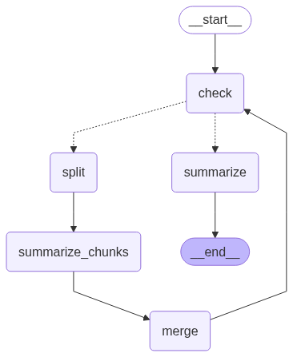
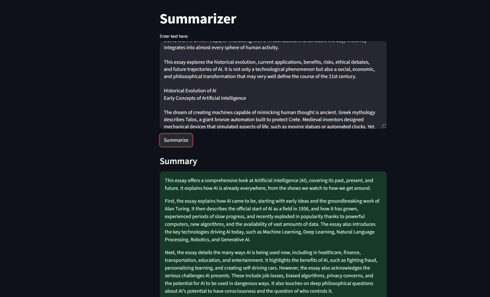

# Text Summarizer with LangGraph

This project is an intelligent text summarization application that can handle texts of any length. It uses a conditional, cyclical graph built with LangGraph to decide whether to summarize text directly or to break it down into chunks, summarize them individually, and then merge them—repeating the process until a final, coherent summary is produced.

The application is powered by Google's Gemini Pro model through the LangChain framework and features a simple web interface built with Streamlit.

## Features

-   **Handles Arbitrarily Long Text**: No more "token limit exceeded" errors. The graph intelligently chunks and summarizes long documents.
-   **Conditional Logic**: Uses LangGraph to dynamically route the summarization process based on text length.
-   **Recursive Summarization**: For very long texts, summaries of chunks are merged and re-summarized in a loop until the content is concise enough for a final pass.
-   **Interactive UI**: A clean and simple web interface built with Streamlit for easy use.
-   **Powered by Google Gemini**: Utilizes Google's powerful `gemini-2.0-flash-lite` model for summarization.

## How It Works: The LangGraph Workflow

The core of this application is a stateful graph that manages the summarization process. The graph determines the best path for the input text based on its token count.

### Visual Workflow



### The Process Steps

1.  **Entry Point (`check`)**: The user's text enters the graph. A function checks the number of tokens in the text.
2.  **Conditional Routing**: Based on the token count, the graph makes a decision:
    *   **If `token_count <= 1000` (Summarize Path)**: The text is short enough to be summarized in one go. It is sent directly to the `summarize` node. The result is produced, and the graph finishes (`END`).
    *   **If `token_count > 1000` (Split & Map-Reduce Path)**: The text is too long and must be broken down.
3.  **Split (`split`)**: The text is divided into smaller, manageable chunks, each under the token limit.
4.  **Summarize Chunks (`summarize_chunks`)**: Each individual chunk is summarized independently. This is the "Map" part of a Map-Reduce pattern.
5.  **Merge (`merge`)**: The summaries of all the chunks are concatenated into a single new document.
6.  **Loop**: The newly merged text is sent **back to the `check` node**. The cycle repeats. The merged summary is checked for its token count, and if it's still too long, it will be split and summarized again. This "Reduce" loop continues until the text is short enough for the final summarization step.

## Demo



## Tech Stack

-   **Graph Orchestration**: LangGraph
-   **LLM Framework**: LangChain
-   **LLM Provider**: Google Gemini (`gemini-2.0-flash-lite`)
-   **Frontend**: Streamlit
-   **Environment Variables**: `python-dotenv`
-   **Token Counting**: `tiktoken`

## Setup and Installation

Follow these steps to run the application on your local machine.

### 1. Clone the Repository

```bash
git clone https://github.com/your-username/your-repository-name.git
cd your-repository-name
```

### 2. Create a Virtual Environment

It is highly recommended to use a virtual environment to manage project dependencies.

```bash
# For Windows
python -m venv venv
venv\Scripts\activate
```

### 3. Install Dependencies

Install all the required Python packages from a `requirements.txt` file.

```bash
pip install -r requirements.txt
```

### 4. Set Up Your Google API Key

The application requires a Google API key to function.

1.  Create a file named `.env` in the root directory of the project.
2.  Add your Google API key to the `.env` file in the following format:

    ```
    GOOGLE_API_KEY="YOUR_GOOGLE_API_KEY_HERE"
    ```

    Replace `"YOUR_GOOGLE_API_KEY_HERE"` with your actual API key.


## ▶️ How to Run the Application

Once the setup is complete, run the following command in your terminal:

```bash
streamlit run app.py
```

Your web browser will automatically open a new tab with the summarizer application.

## Project Structure

```
.
├── app.py              # Main Streamlit application file for the UI
├── summarizer.py       # Contains all the LangGraph logic, nodes, and graph definition
├── graph.png           # The visual representation of the LangGraph workflow
├── .env                # Stores the Google API key (should not be in Git)
└── requirements.txt    # List of Python dependencies
```